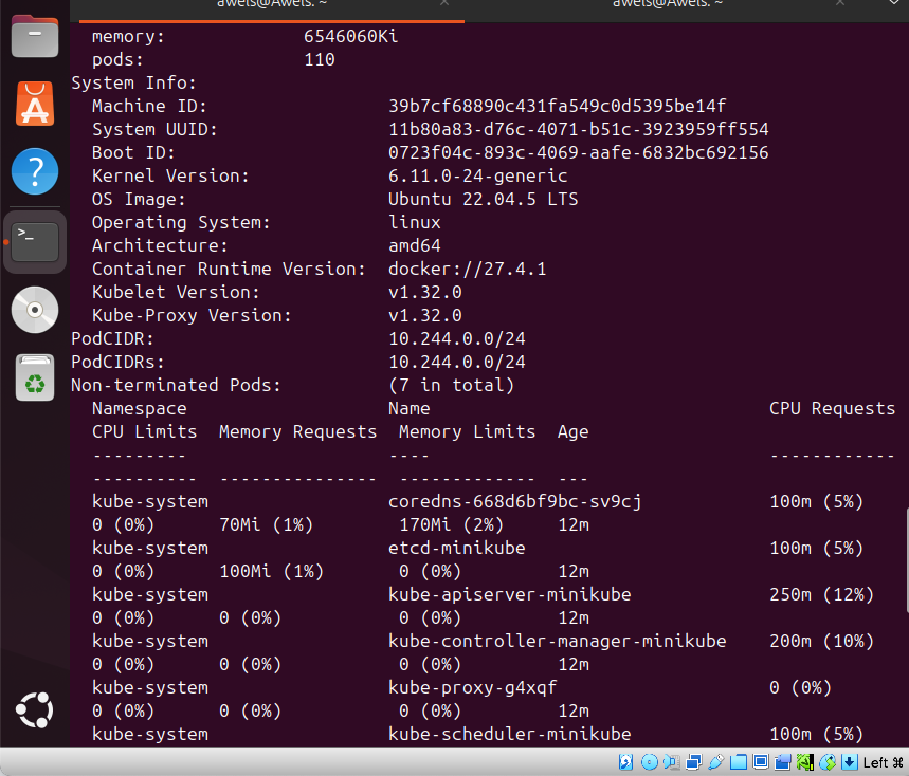

# kuberneteNodes
this is the final project on Kubernetes node

The first thing to do is to start the minikube and this is done by running this command "minikube start". the image below depicts this. 

this command starts a local kubernetes cluster {minikube} using a single-node minikube setup. 

## STOP MINIKUBE CLUSTER 
the next thing to do is to stop minikube cluster using this command "minikube stop". the image below depicts this 

this stops the running Minikube cluster; preserving the cluster state as seen in the image above 

## DELETE MINIKUBE CLUSTER 
the next thing to do is to to delete the minikube cluster. this is done by using this command "minikube delete". the image below depicts this. 

this commanmd deletes the minikubes kubernetes cluster  and its associated resources.

## VIEW NODES 
the next thing to do is to view the nodes and this is done by running this command "kubectl get nodes". the image below depictc this. 
at first i ran the command above but it failed due to the fact that i had stopped my minikube. 

the imnage below depicts this 

i had to get the minikube running before carrying on this task and the image below depicts this. 

To start the minikube, i used this command "minikube start --driver+docker." after which i ran the "kubectl get nodes" and it was successful. the image below depicts this. 

## INSPECT A NODES 
thi is done by running this command "kubectl describe node  <node name>". the images below depicts these and it was successfully. 

## Detailed Summary of Node Scaling and Maintenance in Minikube

In Kubernetes, node scaling and upgrades are essential concepts, especially in production-grade environments where performance, redundancy, and reliability matter.
However, in Minikube, which is mainly used for local development, testing, and experimentation, these concerns are simplified but still important to understand for your foundational knowledge.

1. Node Scaling in Minikube
	•	Minikube by design is a single-node Kubernetes cluster.
	•	This means:
	•	You have only one worker node that runs all your workloads (pods, services, etc.).
	•	This setup is perfect for learning, development, debugging, and testing.
	•	In contrast, real-world production clusters often have multiple nodes, which allow them to distribute workloads, scale horizontally, and ensure high availability.

2. Node Upgrades in Minikube
	•	Minikube makes it easy to upgrade the Kubernetes version used in your local cluster.
	•	This is important because:
	•	It allows you to keep your development environment in sync with the version used in production.
	•	Helps avoid issues that might arise from version mismatches when you deploy your app to production later.
	•	Ensures that your local testing mimics the same features, APIs, and behaviors of the target production cluster.

⸻

Why does this matter even in Minikube?
	•	Although Minikube is not for production, learning how to manage nodes prepares you for real-world Kubernetes clusters.
	•	You can:
	•	Simulate deployments and app management safely in Minikube.
	•	Practice node upgrades and observe how your app behaves across versions.
	•	Use Minikube for testing scaling concepts even with a single node, by simulating multiple pods.

## Conclusion:

Understanding node management in Minikube teaches you key Kubernetes concepts like scaling, versioning, and lifecycle management without needing an expensive, full-scale cluster.
It is especially helpful for:
	•	Developers who want a safe space to test.
	•	Engineers doing proof-of-concept deployments.
	•	Beginners who are building confidence before tackling real production environments.
